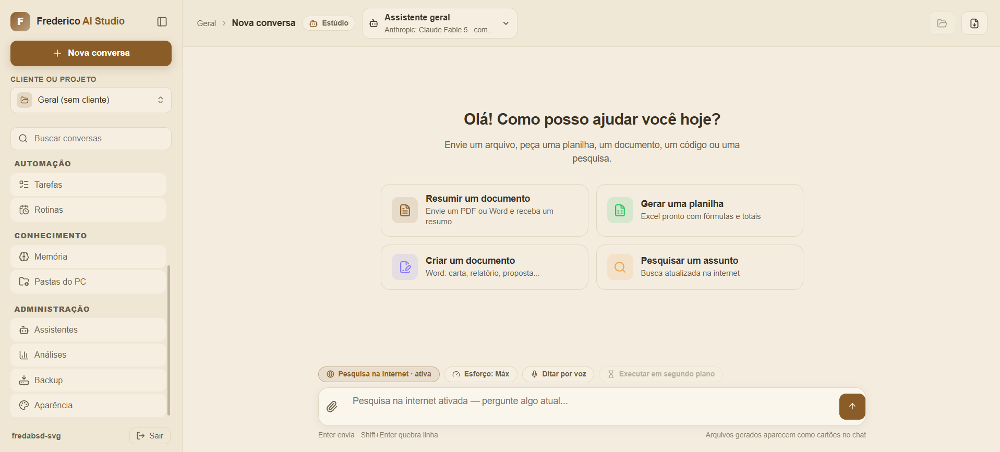
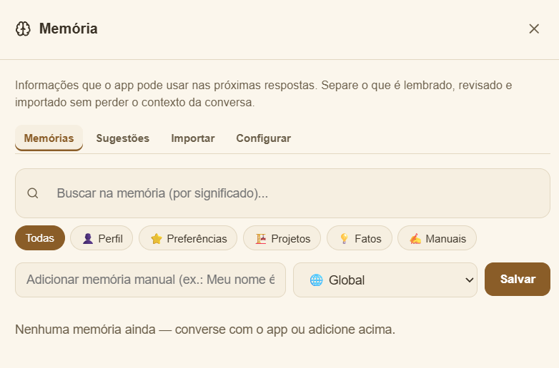
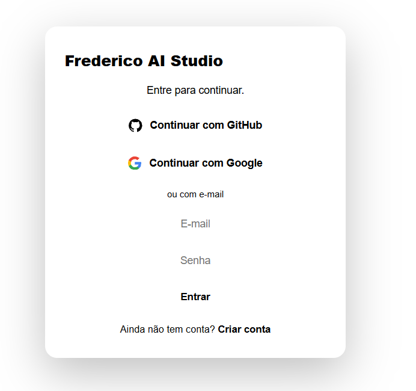
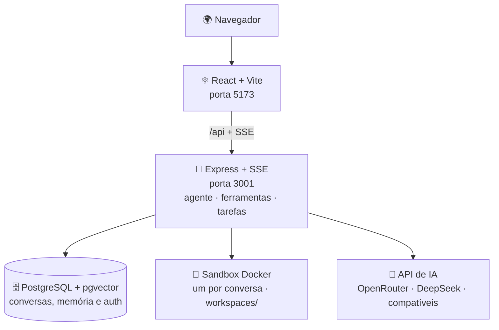

<div align="center">

# 🎨 Frederico IA Studio

**Seu estúdio de IA, em português.**

Converse com modelos de IA, analise arquivos, execute tarefas em um sandbox Docker isolado
e receba arquivos reais no chat — Excel, Word, PDF, gráficos e mais.




</div>

Compatível com **OpenRouter**, **DeepSeek** e qualquer endpoint no padrão da API OpenAI.
Combina chat, ferramentas, memória de longo prazo, pesquisa na web, modo equipe e um
ambiente de execução para documentos, planilhas, PDFs, código e automações.

É **multiusuário**: cada pessoa cria a própria conta (Better Auth) e só enxerga os
próprios dados. Suporta **BYOK** — cada usuário usa a **própria chave** de IA (ideal para
um site público), ou uma chave única do servidor para uso pessoal/de equipe. O modelo que
você escolhe é enviado direto ao provedor, sem substituição.

> 📌 Leia [CONTINUIDADE.md](CONTINUIDADE.md) antes de iniciar uma nova frente de trabalho —
> ele registra a arquitetura, decisões, riscos e próximos passos.

---

## ✨ Principais recursos

| | Recurso | Descrição |
|---|---|---|
| 👤 | **Multiusuário isolado** | Login por conta (Better Auth); cada pessoa só vê os próprios dados, conversas e arquivos |
| 🔑 | **Múltiplos provedores por pessoa** | Cada usuário cadastra e valida suas próprias chaves; OpenRouter, NVIDIA, DeepSeek, Alibaba e outros catálogos ficam isolados |
| 🤖 | **Assistentes personalizados** | Instruções, modelos, ferramentas e personalidade próprios |
| 📄 | **Arquivos reais no chat** | Excel, Word, PDF, CSV, ZIP, imagens, gráficos e OCR |
| 🎨 | **Documentos com design de agência** | O assistente "Documentos profissionais" usa kits prontos e testados (Word, Excel e PDF) — capa, tabelas estilizadas, gráficos, callouts e rodapé paginado; modo **sóbrio/registrável** (ata, contrato) justificado e sem cor para a Junta Comercial |
| 📷 | **Câmera e imagens** | Fotografe um documento (webcam no PC, câmera no celular) ou anexe uma imagem — a IA lê sozinha (**visão** nos modelos com visão; **OCR** nos demais) |
| 🏢 | **Consulta de CNPJ** | Dados cadastrais oficiais (BrasilAPI/ReceitaWS): razão social, situação, CNAE, endereço e sócios |
| 🧠 | **Memória de longo prazo** | Recuperação semântica com painel de revisão |
| 🔀 | **Multiconversa** | Várias conversas processando AO MESMO TEMPO (teto configurável); indicador girando na barra lateral mostra quais estão ativas, e trocar de conversa não interrompe nem mistura nada — ao voltar, o andamento reconecta ao vivo |
| ⏭️ | **Retomada real (checkpoint)** | Tarefa interrompida por limite de ciclos, queda do provedor ou watchdog salva o estado no banco; o botão **Continuar de onde parei** retoma do ponto exato (sem refazer ferramentas nem arquivos já prontos) e sobrevive a reinício do backend |
| 👥 | **Modo Equipe** | Combina perspectivas de vários assistentes |
| 🧩 | **Sistema Multimodelo** | 2+ modelos de IA na mesma mensagem: Comparação lado a lado, Conselho de IAs (coordenador consolida), Debate em rodadas e Especialistas em sequência — com função por modelo, estimativa de custo, orçamento máximo, interrupção por modelo e equipes salvas (presets) |
| 🖥️ | **Sandbox Docker** | Um container por conversa para Python, Bash e geração de arquivos |
| 🛠️ | **Ambiente de Trabalho da IA** | As ações da IA (terminal, código, arquivos, pesquisa, navegador) ficam agrupadas em **uma sessão ao vivo** — cartão compacto no chat que expande numa janela com o passo a passo, o detalhe de cada ação e a **miniatura real** das páginas abertas |
| 🌐 | **Pesquisa na web** | Google Custom Search, ou DuckDuckGo grátis (com dois endpoints de reserva); ao abrir uma página, um **Chromium headless** captura a miniatura |
| 📁 | **Modo Desenvolvedor** | Ambiente dedicado de programação: projetos com memória permanente, explorador de arquivos e painel de atividade ao redor do chat, com seis modos de trabalho (Perguntar, Planejar, Implementar, Corrigir erro, Revisar e Agente autônomo). Painel direito em **abas** — Atividade (passos agrupados e expansíveis), Arquivos (analisados), Alterações (criados/editados, com selo A/M) e Memória; barra lateral com **tarefas recentes** do projeto; pill de status honesto no cabeçalho (sem fingir etapas que o backend não expõe); chip **Permissões** mostra o que a IA pode fazer agora |
| 🔌 | **Conector GitHub** | Conecte a sua conta (token) e a IA clona um repositório, altera o código e envia de volta — push e Pull Request direto pelo chat ou pelo modo desenvolvedor; o token fica cifrado e nunca entra no sandbox |
| 🎙️ | **Voz e segundo plano** | Ditado por voz, tarefas em background, histórico por cliente |
| 🛡️ | **Privacidade (LGPD)** | Consentimento registrado, Política de Privacidade e Termos publicados, e painel "Privacidade e dados": exportar tudo em JSON, apagar o histórico ou excluir a conta — hard delete, sem soft delete |
| 🏷️ | **Seletor de modelos com logos** | Catálogo e filtro por fornecedor com o logo oficial de cada provedor, servido localmente (sem CDN); selo opcional de **classificação de referência** (S+ a B) ao lado do nome, quando o modelo bate com a curadoria em `frontend/src/modelRanking.js` — some sozinho para os demais, e dá para ordenar o catálogo por essa classificação |

A arquitetura, o inventário versionado de prompts, os estados de execução e os critérios de recuperação estão documentados em [docs/AUDITORIA_DEV_MULTIMODELO_PROMPTS.md](docs/AUDITORIA_DEV_MULTIMODELO_PROMPTS.md).

### Execução confiável

Chamadas de ferramenta são validadas antes da execução. Se um provedor devolver
como texto uma chamada que deveria vir no protocolo da API, o app a intercepta,
tenta convertê-la com segurança e **nunca despeja o código interno no chat**
(mesmo quando o modelo não tem ferramentas). Uma tarefa que pediu arquivo só é
considerada concluída quando o arquivo real existe; nesse caso, o download
aparece como cartão na própria resposta. Se a execução falhar, a interface
explica o resultado em linguagem simples e oferece **Reenviar**.

Os arquivos gerados são **checados de verdade** antes de entregar: os `.xlsx`
são **recalculados** (LibreOffice) para detectar erros reais de fórmula
(`#DIV/0!`, `#REF!` etc.) e têm os **gráficos verificados** (referências de
dados inválidas, como intervalos invertidos, são apontadas); os `.docx` são
inspecionados (documento vazio é sinalizado) e os `.pdf` têm as páginas
conferidas. Se o modelo travar repetindo o mesmo trecho, o app corta a saída em
vez de despejar um muro de texto; se o provedor cair no meio, há **failover**
automático para um modelo de reserva sem perder o trabalho.

<div align="center">
<table>
<tr>
<td></td>
<td></td>
</tr>
<tr>
<td align="center"><em>Painel de memória com busca semântica</em></td>
<td align="center"><em>Login com Better Auth: e-mail, GitHub e Google</em></td>
</tr>
</table>
</div>

---

## 🏗️ Arquitetura



O frontend usa a mesma origem e o Vite repassa `/api` para o backend — o chat e o
streaming SSE funcionam também atrás de Tailscale ou de um proxy HTTPS.

**Backend modular:** `backend/src/server.js` só cuida de middlewares e boot; as
rotas vivem em `backend/src/routes/*` (um arquivo por domínio — conversas,
memória, tarefas, rotinas etc.) e o loop do agente em `backend/src/agent/*`
(orquestrador, ferramentas, reparos, visão). A busca semântica roda no próprio
Postgres via `pgvector` (índice HNSW), com fallback automático em JS quando a
extensão não está disponível. **Frontend modular:** `frontend/src/App.jsx` é a
casca de UI; a lógica de chat, conversas, tarefas e assistentes vive em
`frontend/src/hooks/*`.

Nenhum recurso visual vem de CDN: imagens e logos ficam em `frontend/public/` e
são servidos pelo próprio app. Assim a interface não depende de um terceiro para
carregar, e o IP de quem usa o site não é entregue a nenhuma CDN externa.

**Ambiente de Trabalho da IA.** As chamadas de ferramenta de uma resposta são
agrupadas em uma única sessão de execução (`frontend/src/components/ExecutionSession.jsx`)
em vez de dezenas de cartões soltos: um cartão compacto que abre uma janela ao
vivo com o passo a passo humanizado e o detalhe (entrada/resultado) de cada ação.
Quando a IA abre uma página com o `web_fetch`, o backend a renderiza num
**Chromium headless** (`backend/src/agent/pageShot.js`, via `puppeteer-core` +
Chromium do sistema, embutido na imagem Docker) e salva um screenshot exibido na
janela. A captura é *best-effort* e desligável (`WEB_FETCH_SCREENSHOTS=0`), e cada
requisição do navegador é filtrada pela mesma regra anti-SSRF do `web_fetch`.

**Memória + cache.** A **memória de longo prazo** (perfil, notas, fatos e
recuperação semântica de conversas antigas) preserva o contexto entre mensagens:
o `contextBuilder` monta, a cada resposta, um contexto por modelo com perfil,
notas, resumo do início da conversa (quando ela sai da janela) e os trechos
relevantes — com isolamento por cliente. Sobre isso, uma **camada de cache**
(`backend/src/cache.js`, TTL + LRU, sem dependências) reduz custo de tokens e
latência em quatro frentes: **(1) prompt caching** do LLM — o preâmbulo estável
(prompt-base, contrato de qualidade, notas de sistema) é marcado com
`cache_control` e reaproveitado pelo provedor entre mensagens/etapas (via
OpenRouter para Anthropic/Gemini; a DeepSeek direta já cacheia sozinha); **(2)
embeddings** — vetores determinísticos memoizados por hash, evitando recomputar a
mesma pergunta a cada mensagem; **(3) consultas de CNPJ** — TTL longo, pois
dados cadastrais mudam raramente e a base grátis é limitada; **(4) busca web** —
TTL curto contra a repetição imediata. A economia é observável em
`GET /api/cache/stats` e em `usage.cached_tokens` das respostas. Tudo é
configurável/desligável por variáveis de ambiente (ver `.env.example`).

---

## 🚀 Começar

**Pré-requisitos:** Docker Desktop em execução, uma chave de API compatível com OpenAI
e os segredos do Better Auth.

### 1️⃣ Configurar o ambiente

```powershell
Copy-Item .env.example .env
```

Preencha ao menos estes valores no `.env`:

```env
BETTER_AUTH_URL=http://localhost:5173
BETTER_AUTH_SECRET=gere_com_openssl_rand_hex_32
ENCRYPTION_KEY=gere_outro_com_openssl_rand_hex_32
```

Depois de entrar no aplicativo, abra **Provedores de IA** e cadastre uma ou
mais chaves. Os modelos só aparecem após a validação da respectiva chave.

> GitHub e Google são opcionais — deixe as credenciais OAuth vazias para usar só e-mail/senha.

### 2️⃣ Subir o aplicativo

```powershell
docker compose up --build
```

No Windows, o `iniciar.bat` prepara e inicia tudo. Abra [http://localhost:5173](http://localhost:5173).

### Acesso pelo celular via Tailscale

No celular, nunca abra `localhost:5173`: `localhost` aponta para o próprio
celular. Com o app e o Tailscale ligados no computador, publique a porta do
frontend e consulte o endereço HTTPS:

```powershell
tailscale serve --bg 5173
tailscale serve status
```

Use no celular a URL `https://...ts.net` exibida pelo segundo comando. Coloque
essa mesma origem em `BETTER_AUTH_URL` no `.env` e recrie o backend. Mantenha
`FRONTEND_URL=http://localhost:5173` para o acesso local continuar autorizado.

Para login social, registre também no provedor:

```text
https://SEU_HOST.ts.net/api/auth/callback/github
https://SEU_HOST.ts.net/api/auth/callback/google
```

O computador e o celular precisam aparecer conectados na mesma rede Tailscale.
O endereço HTTPS do Serve é privado para essa rede.

### 3️⃣ Atualizar uma instalação existente

```powershell
git pull
docker compose up --build -d
```

---

## ⚙️ Variáveis importantes

| Variável | Padrão | Finalidade |
|---|---|---|
| `DEEPSEEK_BASE_URL` | DeepSeek | Base usada como referência para tarefas internas legadas |
| `DEEPSEEK_MODEL` | deepseek-chat | Modelo de referência para tarefas internas legadas |
| `OPENROUTER_PROVIDER_SORT` | automático | Ordenação opcional de provedores no OpenRouter |
| `BETTER_AUTH_URL` | http://localhost:5173 | Origem pública do app e callbacks OAuth |
| `BETTER_AUTH_SECRET` | — | Segredo de sessão do Better Auth |
| `ENCRYPTION_KEY` | — | Criptografa a chave de IA de cada usuário (BYOK) no banco |
| `FREE_TIER_API_KEY` | — | Liga o **modo gratuito**: chave da plataforma (só no servidor) para novos usuários conversarem sem configurar nada |
| `FREE_TIER_BASE_URL` | OpenRouter | Base OpenAI-compatível do modo gratuito |
| `FREE_TIER_MODELS` | modelos `:free` | Allowlist de modelos gratuitos, em ordem de preferência (o 1º é o padrão; os demais são reserva) |
| `FREE_TIER_MSGS_PER_DAY` | 20 | Mensagens gratuitas por usuário/dia (admin ajusta pelo painel sem reiniciar) |
| `FREE_TIER_MSGS_PER_MIN` | 4 | Freio anti-rajada do modo gratuito |
| `FREE_TIER_CONCURRENCY` | 2 | Respostas gratuitas simultâneas (fila global protege a cota no provedor) |
| `FREE_TIER_QUEUE_MAX` | 30 | Tamanho máximo da fila do modo gratuito |
| `RATE_MSGS_PER_DAY` | 0 (sem limite) | Máximo de mensagens por usuário por dia |
| `RATE_API_PER_MIN` | 600 | Rate limit HTTP geral da API por IP/minuto (0 desliga) |
| `RATE_AUTH_PER_15MIN` | 50 | Rate limit de login/cadastro por IP a cada 15 min (0 desliga) |
| `MAX_SANDBOXES_PER_USER` | 2 | Sandboxes ativos ao mesmo tempo por usuário |
| `MAX_ACTIVE_RUNS_PER_USER` | 5 | Conversas do mesmo usuário processando ao mesmo tempo (multiconversa); conversas que executam código também disputam `MAX_SANDBOXES_PER_USER` |
| `CHECKPOINT_MAX_BYTES` | 600000 | Tamanho máximo do estado de execução salvo por conversa (retomada real); array aparado preservando objetivo + resultados recentes |
| `TOOL_TIMEOUT_MS` | 45000 | Tempo máximo de um comando de sandbox |
| `AGENT_MAX_STEPS` | conforme o esforço | Limite de etapas da tarefa |
| `SANDBOX_MEMORY / SANDBOX_CPUS` | 1024m / 1 | Recursos do sandbox |
| `WEB_FETCH_SCREENSHOTS` | 1 | Miniatura da página aberta pelo `web_fetch` (Chromium headless); `0` desliga (só o texto) |
| `SCREENSHOT_TIMEOUT_MS` | 9000 | Tempo máximo por captura de miniatura (best-effort) |
| `CHROMIUM_PATH` | /usr/bin/chromium | Caminho do Chromium do sistema (já definido no Dockerfile) |
| `MODEL_FALLBACKS` | — | Modelos de reserva (ordem) para failover automático quando o provedor cai; sem isso, cai para o modelo-base da conta |
| `STREAM_STALL_TIMEOUT_MS` | 180000 | Watchdog do streaming: tempo máximo sem receber nenhum dado do provedor antes de abortar e retomar/failover (piso 30000) |
| `PROVIDER_CONNECT_TIMEOUT_MS` | 180000 | Tempo máximo até o provedor começar a responder a chamada de streaming (piso 30000) |
| `VALIDATE_RECALC` | true | Recalcula .xlsx/.xlsm com LibreOffice para detectar erros reais de fórmula (#DIV/0!, #REF!); `false` = validação parcial mais rápida |
| `OUTPUT_RETENTION_DAYS` | 0 (desligado) | Remove arquivos de saída mais antigos que N dias (útil em uso público/soak) |
| `CONVERSATION_RETENTION_DAYS` | 0 (desligado) | LGPD: apaga em definitivo conversas sem atividade há mais de N dias (mensagens, arquivos, memórias derivadas e workspace) |
| `USAGE_RETENTION_DAYS` | 365 | Retenção do registro de consumo de tokens (usage/usage_daily); 0 mantém para sempre |

Consulte o [.env.example](.env.example) para todas as opções.

---

## 🆓 Modo gratuito (primeiro acesso sem chave)

Para eliminar a barreira inicial de configuração, o app tem um **modo gratuito**: no primeiro
acesso, quem ainda não tem chave escolhe entre **"Começar gratuitamente"** (conversa na hora,
usando modelos gratuitos pagos/limitados pela plataforma) e **"Configurar minha própria chave"**
(um assistente passo a passo guia a criação da chave em provedores como OpenRouter, DeepSeek,
Groq, Google Gemini e Mistral).

Como funciona por dentro:

- **A chave gratuita fica só no servidor** (`FREE_TIER_API_KEY` no `.env`/secret do backend).
  O navegador fala apenas com `/api`; **só o backend** fala com o provedor de IA. A chave nunca
  aparece no frontend, no app ou no repositório.
- **Allowlist de modelos:** no modo gratuito só os modelos de `FREE_TIER_MODELS` são usados
  (padrão: modelos `:free` do OpenRouter). Se o modelo escolhido falhar (429/queda), o app tenta
  automaticamente o próximo da lista. A lista `:free` do OpenRouter muda com frequência —
  confira em [openrouter.ai/collections/free-models](https://openrouter.ai/collections/free-models).
- **Limites e fila com transparência:** limite diário por usuário (com renovação à meia-noite no
  fuso do app), freio por minuto e fila global de concorrência limitada. O usuário vê no chat o
  chip "Modo gratuito" com o modelo, o provedor, as mensagens restantes, o horário de renovação e
  a posição na fila — e pode **cancelar** enquanto espera. Ao atingir o limite, aparece uma tela
  amigável com opções (aguardar, configurar chave própria, tutorial), não um erro técnico.
- **Painel do administrador** (menu Administração → Modo gratuito, só para `ADMIN_EMAIL`):
  usuários ativos, consumo por usuário/modelo/dia, erros e indisponibilidades, limite global e
  individual, ativar/desativar modelos e **bloquear usuários por abuso** — tudo sem reiniciar.
- **Termos dos provedores:** o OpenRouter permite servir seus usuários por um backend próprio
  (proíbe revenda direta de acesso à API e multi-contas para burlar limites; a cota é por conta:
  ~50 req/dia, ou ~1.000 req/dia após uma compra única de US$ 10). Alguns provedores **proíbem**
  servir usuários finais no nível gratuito (ex.: NVIDIA NIM, Cohere trial, GitHub Models) — não
  os use como `FREE_TIER_BASE_URL`. Modelos locais (Ollama em `http://host:11434/v1`) também
  funcionam como modo gratuito, sem termos de terceiros.
- **Privacidade (LGPD):** muitos modelos gratuitos registram/treinam com os prompts. Se ativar o
  modo gratuito num site público, reflita isso na sua Política de Privacidade.

---

## 🔒 Segurança e limites atuais

- ✅ **Isolamento por usuário concluído:** cada conta só acessa os próprios dados (posse verificada em cada consulta). As chaves de IA por usuário são guardadas **criptografadas**.
- 🧱 **Camada HTTP endurecida:** headers de segurança via `helmet` (X-Frame-Options, nosniff, HSTS), CORS restrito à própria origem (sem `FRONTEND_URL` nenhuma origem externa é aceita — o antigo fallback `*` foi removido), rate limiting geral por IP (`RATE_API_PER_MIN`) e janela apertada para login/cadastro (`RATE_AUTH_PER_15MIN`), além de validação estruturada de entrada com `zod` nas rotas de escrita.
- 🛡️ **Antivírus nos uploads (ClamAV):** todo arquivo enviado (anexos, caixa de entrada, importação de memória) é escaneado antes de ser salvo; infectado é recusado com aviso e o usuário vê "✓ verificado" quando passa. Ligado por padrão em produção (`docker-compose.prod.yml`); opcional no dev (`--profile antivirus`). Veja o Passo 8 do [VPS-DEPLOY.md](VPS-DEPLOY.md).
- 🪧 **Segurança visível ao usuário:** a tela de login exibe selos (arquivos verificados por antivírus, conexão criptografada, compromisso com a LGPD — com link para `/privacidade`) e a página de apresentação tem um bloco de confiança com 6 cartões (dados isolados, chave própria/BYOK, credenciais protegidas, arquivos verificados, HTTPS, LGPD). Regra: só anunciar o que está de fato ativo — se desativar o ClamAV, remova os selos correspondentes.
- ⚠️ O backend recebe o **socket Docker** — permissão privilegiada; use uma máquina **dedicada** a este app.
- 🔐 A sandbox roda **sem privilégios** e com limites de CPU/memória, mas a rede fica habilitada para pesquisas e automações — código executado por um usuário tem acesso à internet.
- 🛰️ **Proteção contra SSRF no `web_fetch`:** o backend bloqueia hostnames/IPs internos (loopback, faixas privadas IPv4, metadados de nuvem `169.254.169.254`, IPv6 loopback/ULA/link-local, incluindo a forma IPv4-mapeada) **e resolve o DNS validando cada IP antes de conectar** (defesa contra DNS rebinding), revalidando a cada redirect. Cobertura verificada em `backend/src/tools.ssrf.test.js`.
- 🌍 **Site público:** qualquer pessoa pode se cadastrar. Para uso amplo/indexado, considere adicionar confirmação de e-mail e/ou aprovação de conta; enquanto isso, prefira divulgar "por link" e mantenha os limites (`RATE_MSGS_PER_DAY`, `MAX_SANDBOXES_PER_USER`).
- 📋 Conteúdo enviado ao modelo pode ser transmitido ao provedor configurado — avalie **LGPD** e sigilo antes de enviar dados sensíveis.

### 🛡️ LGPD (Lei 13.709/2018) — conformidade embutida

- **Documentos legais publicados:** Política de Privacidade em `/privacidade` e Termos de Uso em `/termos` (públicos, sem login), com links na landing, no cadastro e dentro do app. Ao alterar os textos de forma relevante, atualize a `TERMS_VERSION` em `backend/src/privacy.js` (fonte única — o frontend lê a versão de `/api/health`) — todos os usuários verão o pedido de aceite de novo.
- **Consentimento registrado (art. 8º):** checkbox opt-in (desmarcado por padrão) no cadastro; para login social e contas antigas, um modal bloqueante pede o aceite na primeira entrada. Cada aceite fica registrado em `user_consents` com versão, data, IP e navegador (evidência).
- **Direitos do titular (art. 18)** no menu **Privacidade e dados**: exportar todos os dados em JSON (portabilidade), apagar todo o histórico de conversas e **excluir a conta** — tudo **hard delete** (banco + workspaces em disco), sem soft delete. Apagar o histórico remove também as memórias **e as sugestões de memória** extraídas das conversas (memórias manuais e importadas são preservadas); o diálogo de excluir conta exige digitar o e-mail **sem exibi-lo**.
- **Minimização:** cadastro pede só nome, e-mail e senha; aviso fixo no chat lembra de não enviar dados sensíveis; retenção automática opcional (`CONVERSATION_RETENTION_DAYS`); logs do servidor não gravam o conteúdo das conversas.
- **Segurança:** senhas com hash (Better Auth/scrypt), chaves de API e tokens cifrados (AES-256-GCM), isolamento por usuário verificado em cada consulta.

---

## ✅ Validação local

```powershell
docker compose exec -T backend node --test "src/**/*.test.js"
docker compose exec -T frontend node --test src/authUrls.test.js src/sse.test.js
docker compose exec -T frontend npm run build
```

O mesmo conjunto roda automaticamente no **GitHub Actions** (`.github/workflows/ci.yml`) a cada push/PR: testes do backend, testes do frontend e build de produção.

---

## 📚 Documentação complementar

| Documento | Conteúdo |
|---|---|
| [CONTINUIDADE.md](CONTINUIDADE.md) | Estado atual, decisões e handoff |
| [NOTEBOOK-SERVIDOR.md](NOTEBOOK-SERVIDOR.md) | Acesso remoto com notebook e Tailscale |
| [VPS-DEPLOY.md](VPS-DEPLOY.md) | Publicação em VPS com HTTPS |

## 🤝 Processo de contribuição

Toda mudança relevante precisa atualizar o `CONTINUIDADE.md`, passar por validação,
receber um commit descritivo em português e ser enviada ao GitHub na mesma sessão.

<div align="center">

Feito com ☕ por [fredabsd-svg](https://github.com/fredabsd-svg)

</div>
