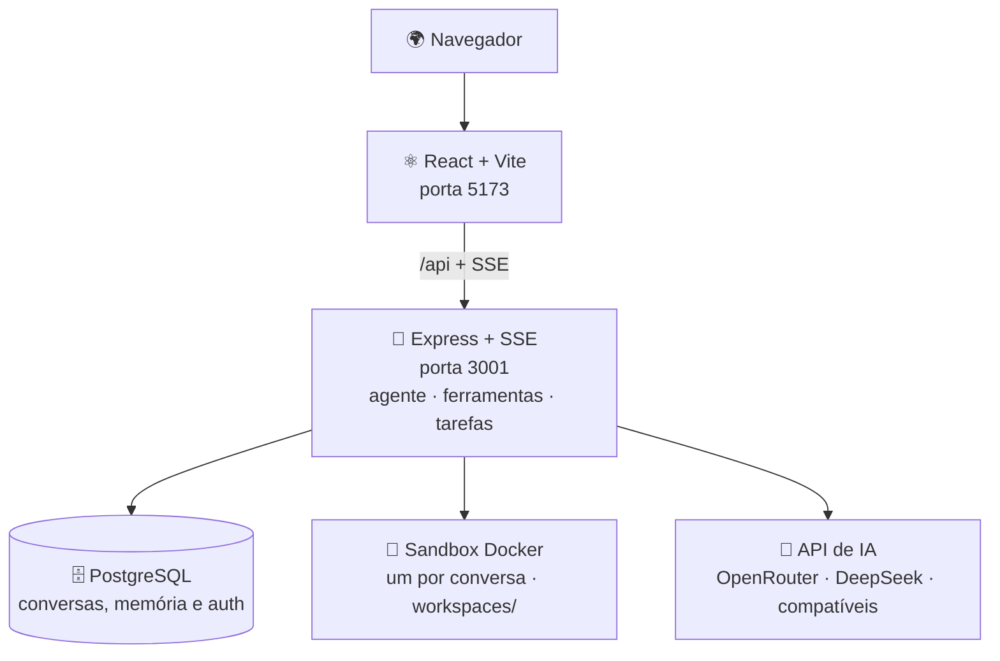

<div align="center">

# 🎨 Frederico IA Studio

**Seu estúdio de IA, em português.**

Converse com modelos de IA, analise arquivos, execute tarefas em um sandbox Docker isolado
e receba arquivos reais no chat — Excel, Word, PDF, gráficos e mais.


</div>

Compatível com **OpenRouter**, **DeepSeek** e qualquer endpoint no padrão da API OpenAI.
Combina chat, ferramentas, memória de longo prazo, pesquisa na web, modo equipe e um
ambiente de execução para documentos, planilhas, PDFs, código e automações.

É **multiusuário**: cada pessoa cria a própria conta (Better Auth) e só enxerga os
próprios dados. Suporta **BYOK** — cada usuário usa a **própria chave** de IA (ideal para
um site público), ou uma chave única do servidor para uso pessoal/de equipe. O modelo que
você escolhe é enviado direto ao provedor, sem substituição.

> 📌 Leia [CONTINUIDADE.md](CONTINUIDADE.md) antes de iniciar uma nova frente de trabalho —
> ele registra a arquitetura, decisões, riscos e próximos passos.

---

## ✨ Principais recursos

| | Recurso | Descrição |
|---|---|---|
| 👤 | **Multiusuário isolado** | Login por conta (Better Auth); cada pessoa só vê os próprios dados, conversas e arquivos |
| 🔑 | **Cada um com sua chave (BYOK)** | Cada usuário cadastra a própria chave de IA — dá para exigir isso num site público (`ALLOW_SHARED_KEY=false`) |
| 🤖 | **Assistentes personalizados** | Instruções, modelos, ferramentas e personalidade próprios |
| 📄 | **Arquivos reais no chat** | Excel, Word, PDF, CSV, ZIP, imagens, gráficos e OCR |
| 🎨 | **Documentos com design de agência** | O assistente "Documentos profissionais" usa kits prontos e testados (Word, Excel e PDF) — capa, tabelas estilizadas, gráficos, callouts e rodapé paginado; modo **sóbrio/registrável** (ata, contrato) justificado e sem cor para a Junta Comercial |
| 📷 | **Câmera e imagens** | Fotografe um documento (webcam no PC, câmera no celular) ou anexe uma imagem — a IA lê sozinha (**visão** nos modelos com visão; **OCR** nos demais) |
| 🏢 | **Consulta de CNPJ** | Dados cadastrais oficiais (BrasilAPI/ReceitaWS): razão social, situação, CNAE, endereço e sócios |
| 🧠 | **Memória de longo prazo** | Recuperação semântica com painel de revisão |
| 👥 | **Modo Equipe** | Combina perspectivas de vários assistentes |
| 🖥️ | **Sandbox Docker** | Um container por conversa para Python, Bash e geração de arquivos |
| 🌐 | **Pesquisa na web** | Google Custom Search, ou DuckDuckGo grátis (com dois endpoints de reserva) |
| 📁 | **Modo Desenvolvedor** | Trabalhe sobre uma pasta de projeto autorizada |
| 🎙️ | **Voz e segundo plano** | Ditado por voz, tarefas em background, histórico por cliente |

### Execução confiável

Chamadas de ferramenta são validadas antes da execução. Se um provedor devolver
como texto uma chamada que deveria vir no protocolo da API, o app a intercepta,
tenta convertê-la com segurança e **nunca despeja o código interno no chat**
(mesmo quando o modelo não tem ferramentas). Uma tarefa que pediu arquivo só é
considerada concluída quando o arquivo real existe; nesse caso, o download
aparece como cartão na própria resposta. Se a execução falhar, a interface
explica o resultado em linguagem simples e oferece **Reenviar**.

Os arquivos gerados são **checados de verdade** antes de entregar: os `.xlsx`
são **recalculados** (LibreOffice) para detectar erros reais de fórmula
(`#DIV/0!`, `#REF!` etc.) e têm os **gráficos verificados** (referências de
dados inválidas, como intervalos invertidos, são apontadas); os `.docx` são
inspecionados (documento vazio é sinalizado) e os `.pdf` têm as páginas
conferidas. Se o modelo travar repetindo o mesmo trecho, o app corta a saída em
vez de despejar um muro de texto; se o provedor cair no meio, há **failover**
automático para um modelo de reserva sem perder o trabalho.

<div align="center">
<table>
<tr>
<td></td>
<td></td>
</tr>
<tr>
<td align="center"><em>Painel de memória com busca semântica</em></td>
<td align="center"><em>Login com Better Auth: e-mail, GitHub e Google</em></td>
</tr>
</table>
</div>

---

## 🏗️ Arquitetura



O frontend usa a mesma origem e o Vite repassa `/api` para o backend — o chat e o
streaming SSE funcionam também atrás de Tailscale ou de um proxy HTTPS.

---

## 🚀 Começar

**Pré-requisitos:** Docker Desktop em execução, uma chave de API compatível com OpenAI
e os segredos do Better Auth.

### 1️⃣ Configurar o ambiente

```powershell
Copy-Item .env.example .env
```

Preencha ao menos estes valores no `.env`:

```env
DEEPSEEK_API_KEY=sua_chave
DEEPSEEK_BASE_URL=https://openrouter.ai/api/v1
DEEPSEEK_MODEL=deepseek/deepseek-chat

BETTER_AUTH_URL=http://localhost:5173
BETTER_AUTH_SECRET=gere_com_openssl_rand_hex_32
ENCRYPTION_KEY=gere_outro_com_openssl_rand_hex_32
```

> GitHub e Google são opcionais — deixe as credenciais OAuth vazias para usar só e-mail/senha.

### 2️⃣ Subir o aplicativo

```powershell
docker compose up --build
```

No Windows, o `iniciar.bat` prepara e inicia tudo. Abra [http://localhost:5173](http://localhost:5173).

### Acesso pelo celular via Tailscale

No celular, nunca abra `localhost:5173`: `localhost` aponta para o próprio
celular. Com o app e o Tailscale ligados no computador, publique a porta do
frontend e consulte o endereço HTTPS:

```powershell
tailscale serve --bg 5173
tailscale serve status
```

Use no celular a URL `https://...ts.net` exibida pelo segundo comando. Coloque
essa mesma origem em `BETTER_AUTH_URL` no `.env` e recrie o backend. Mantenha
`FRONTEND_URL=http://localhost:5173` para o acesso local continuar autorizado.

Para login social, registre também no provedor:

```text
https://SEU_HOST.ts.net/api/auth/callback/github
https://SEU_HOST.ts.net/api/auth/callback/google
```

O computador e o celular precisam aparecer conectados na mesma rede Tailscale.
O endereço HTTPS do Serve é privado para essa rede.

### 3️⃣ Atualizar uma instalação existente

```powershell
git pull
docker compose up --build -d
```

---

## ⚙️ Variáveis importantes

| Variável | Padrão | Finalidade |
|---|---|---|
| `DEEPSEEK_API_KEY` | — | Chave do provedor de IA |
| `DEEPSEEK_BASE_URL` | DeepSeek | Base compatível com OpenAI |
| `DEEPSEEK_MODEL` | deepseek-chat | Modelo principal |
| `OPENROUTER_PROVIDER_SORT` | automático | Ordenação opcional de provedores no OpenRouter |
| `BETTER_AUTH_URL` | http://localhost:5173 | Origem pública do app e callbacks OAuth |
| `BETTER_AUTH_SECRET` | — | Segredo de sessão do Better Auth |
| `ENCRYPTION_KEY` | — | Criptografa a chave de IA de cada usuário (BYOK) no banco |
| `ALLOW_SHARED_KEY` | true | `false` num site público: cada usuário precisa da própria chave |
| `RATE_MSGS_PER_DAY` | 0 (sem limite) | Máximo de mensagens por usuário por dia |
| `MAX_SANDBOXES_PER_USER` | 2 | Sandboxes ativos ao mesmo tempo por usuário |
| `TOOL_TIMEOUT_MS` | 45000 | Tempo máximo de um comando de sandbox |
| `AGENT_MAX_STEPS` | conforme o esforço | Limite de etapas da tarefa |
| `SANDBOX_MEMORY / SANDBOX_CPUS` | 1024m / 1 | Recursos do sandbox |
| `MODEL_FALLBACKS` | — | Modelos de reserva (ordem) para failover automático quando o provedor cai; sem isso, cai para o modelo-base da conta |
| `VALIDATE_RECALC` | true | Recalcula .xlsx/.xlsm com LibreOffice para detectar erros reais de fórmula (#DIV/0!, #REF!); `false` = validação parcial mais rápida |
| `OUTPUT_RETENTION_DAYS` | 0 (desligado) | Remove arquivos de saída mais antigos que N dias (útil em uso público/soak) |

Consulte o [.env.example](.env.example) para todas as opções.

---

## 🔒 Segurança e limites atuais

- ✅ **Isolamento por usuário concluído:** cada conta só acessa os próprios dados (posse verificada em cada consulta). As chaves de IA por usuário são guardadas **criptografadas**.
- ⚠️ O backend recebe o **socket Docker** — permissão privilegiada; use uma máquina **dedicada** a este app.
- 🔐 A sandbox roda **sem privilégios** e com limites de CPU/memória, mas a rede fica habilitada para pesquisas e automações — código executado por um usuário tem acesso à internet.
- 🌍 **Site público:** qualquer pessoa pode se cadastrar. Para uso amplo/indexado, considere adicionar confirmação de e-mail e/ou aprovação de conta; enquanto isso, prefira divulgar "por link" e mantenha os limites (`RATE_MSGS_PER_DAY`, `MAX_SANDBOXES_PER_USER`).
- 📋 Conteúdo enviado ao modelo pode ser transmitido ao provedor configurado — avalie **LGPD** e sigilo antes de enviar dados sensíveis.

---

## ✅ Validação local

```powershell
docker compose exec -T backend node --test src/agent.control.test.js src/agent.outputDelivery.test.js src/toolProtocol.test.js src/taskOutcome.test.js
docker compose exec -T frontend node --test src/authUrls.test.js src/sse.test.js
docker compose exec -T frontend npm run build
```

---

## 📚 Documentação complementar

| Documento | Conteúdo |
|---|---|
| [CONTINUIDADE.md](CONTINUIDADE.md) | Estado atual, decisões e handoff |
| [NOTEBOOK-SERVIDOR.md](NOTEBOOK-SERVIDOR.md) | Acesso remoto com notebook e Tailscale |
| [VPS-DEPLOY.md](VPS-DEPLOY.md) | Publicação em VPS com HTTPS |

## 🤝 Processo de contribuição

Toda mudança relevante precisa atualizar o `CONTINUIDADE.md`, passar por validação,
receber um commit descritivo em português e ser enviada ao GitHub na mesma sessão.

<div align="center">

Feito com ☕ por [fredabsd-svg](https://github.com/fredabsd-svg)

</div>
