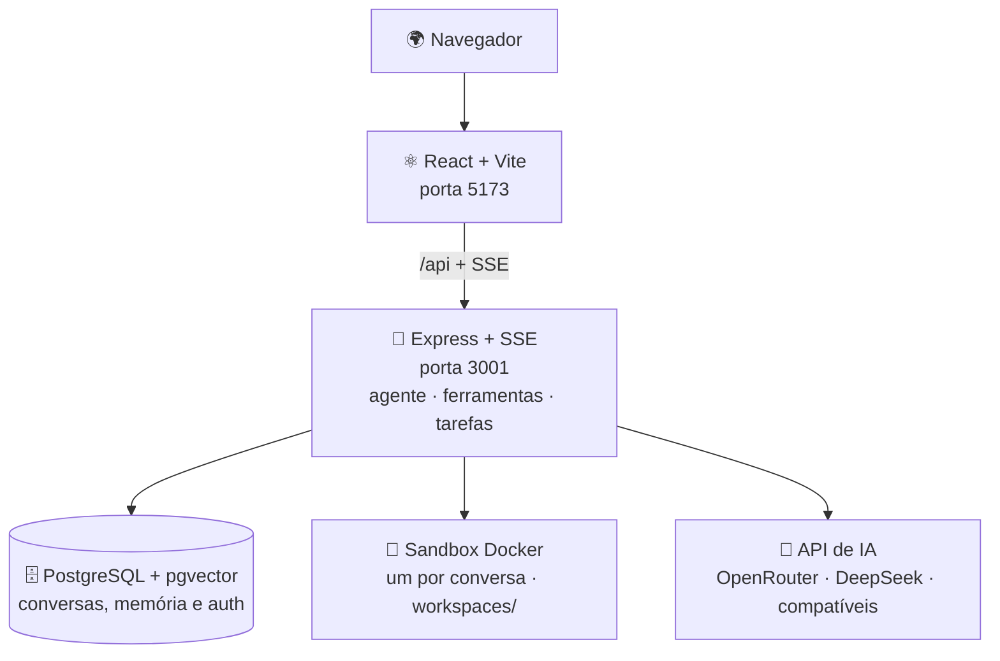

# 🏗️ Arquitetura

Como o Frederico IA Studio é montado por dentro: fluxo de dados, módulos,
execução confiável, memória e cache.

> Para o estado atual, decisões e handoff, veja o [CONTINUIDADE.md](../CONTINUIDADE.md).

---

## Visão geral

O frontend usa a mesma origem e o Vite repassa `/api` para o backend — o chat e o
streaming SSE funcionam também atrás de Tailscale ou de um proxy HTTPS.

Nenhum recurso visual vem de CDN: imagens e logos ficam em `frontend/public/` e
são servidos pelo próprio app. Assim a interface não depende de um terceiro para
carregar, e o IP de quem usa o site não é entregue a nenhuma CDN externa.

---

## Módulos

**Backend.** `backend/src/server.js` só cuida de middlewares e boot; as rotas
vivem em `backend/src/routes/*` (um arquivo por domínio — conversas, memória,
tarefas, rotinas, análises, backup, conectores, copiloto etc.), o loop do agente
em `backend/src/agent/*` (orquestrador, ferramentas, reparos, visão, checkpoints)
e as métricas de saúde em `backend/src/healthMetrics.js`. A busca semântica roda
no próprio Postgres via `pgvector` (índice HNSW), com fallback automático em JS
quando a extensão não está disponível.

**Frontend.** `frontend/src/App.jsx` é a casca de UI; a lógica de chat,
conversas, tarefas e assistentes vive em `frontend/src/hooks/*`, e as telas
compostas em `frontend/src/components/*`.

**Copiloto (Nino).** `backend/src/companion/*` (monitor, incidentes, saúde,
permissões, auditoria, sugestões) + `backend/src/copilot/*` (chat e documentos
próprios do copiloto), com `frontend/src/Companion.jsx`,
`components/NinoAvatar.jsx` e `components/CopilotWorkspace.jsx` no cliente.

---

## Ambiente de Trabalho da IA

As chamadas de ferramenta de uma resposta são agrupadas em uma única sessão de
execução (`frontend/src/components/ExecutionSession.jsx`) em vez de dezenas de
cartões soltos: um cartão compacto que abre uma janela ao vivo com o passo a
passo humanizado e o detalhe (entrada/resultado) de cada ação.

Quando a IA abre uma página com o `web_fetch`, o backend a renderiza num
**Chromium headless** (`backend/src/agent/pageShot.js`, via `puppeteer-core` +
Chromium do sistema, embutido na imagem Docker) e salva um screenshot exibido na
janela. A captura é *best-effort* e desligável (`WEB_FETCH_SCREENSHOTS=0`), e cada
requisição do navegador é filtrada pela mesma regra anti-SSRF do `web_fetch`.

---

## Execução confiável

Chamadas de ferramenta são validadas antes da execução. Se um provedor devolver
como texto uma chamada que deveria vir no protocolo da API, o app a intercepta,
tenta convertê-la com segurança e **nunca despeja o código interno no chat**
(mesmo quando o modelo não tem ferramentas). Uma tarefa que pediu arquivo só é
considerada concluída quando o arquivo real existe; nesse caso, o download
aparece como cartão na própria resposta. Se a execução falhar, a interface
explica o resultado em linguagem simples e oferece **Reenviar**.

Os arquivos gerados são **checados de verdade** antes de entregar:

- **`.xlsx`** — recalculados no LibreOffice para detectar erros reais de fórmula
  (`#DIV/0!`, `#REF!` etc.) e com os **gráficos verificados** (referências de
  dados inválidas, como intervalos invertidos, são apontadas).
- **`.docx`** — inspecionados (documento vazio é sinalizado).
- **`.pdf`** — páginas conferidas.

Se o modelo travar repetindo o mesmo trecho, o app corta a saída em vez de
despejar um muro de texto; se o provedor cair no meio, há **failover** automático
para um modelo de reserva sem perder o trabalho. Uma tarefa interrompida por
limite de ciclos, queda do provedor ou watchdog salva o estado no banco
(checkpoint), e o botão **Continuar de onde parei** retoma do ponto exato — sem
refazer ferramentas nem arquivos já prontos, sobrevivendo a reinício do backend.

O inventário versionado de prompts, os estados de execução e os critérios de
recuperação estão em
[AUDITORIA_DEV_MULTIMODELO_PROMPTS.md](AUDITORIA_DEV_MULTIMODELO_PROMPTS.md).

---

## Memória + cache

A **memória de longo prazo** (perfil, notas, fatos e recuperação semântica de
conversas antigas) preserva o contexto entre mensagens: o `contextBuilder` monta,
a cada resposta, um contexto por modelo com perfil, notas, resumo do início da
conversa (quando ela sai da janela) e os trechos relevantes — com isolamento por
cliente e filtro de relevância por domínio.

Sobre isso, uma **camada de cache** (`backend/src/cache.js`, TTL + LRU, sem
dependências) reduz custo de tokens e latência em quatro frentes:

1. **Prompt caching do LLM** — o preâmbulo estável (prompt-base, contrato de
   qualidade, notas de sistema) é marcado com `cache_control` e reaproveitado
   pelo provedor entre mensagens/etapas (via OpenRouter para Anthropic/Gemini;
   a DeepSeek direta já cacheia sozinha).
2. **Embeddings** — vetores determinísticos memoizados por hash, evitando
   recomputar a mesma pergunta a cada mensagem.
3. **Consultas de CNPJ** — TTL longo, pois dados cadastrais mudam raramente e a
   base grátis é limitada.
4. **Busca web** — TTL curto contra a repetição imediata.

A economia é observável em `GET /api/cache/stats` e em `usage.cached_tokens` das
respostas. Tudo é configurável/desligável por variáveis de ambiente
(ver [CONFIGURACAO.md](CONFIGURACAO.md)).

---

## Compreensão documental (Docling)

Camada opcional (`DOCLING_ENABLED`) que processa PDFs e documentos **uma única
vez** — layout, ordem de leitura, tabelas e OCR quando necessário — guarda o JSON
completo como fonte da verdade e envia à IA um Markdown otimizado com referência
de página, em vez de mandar o arquivo cru e deixar cada modelo re-extrair.
Detalhes em [DOCLING.md](DOCLING.md).
